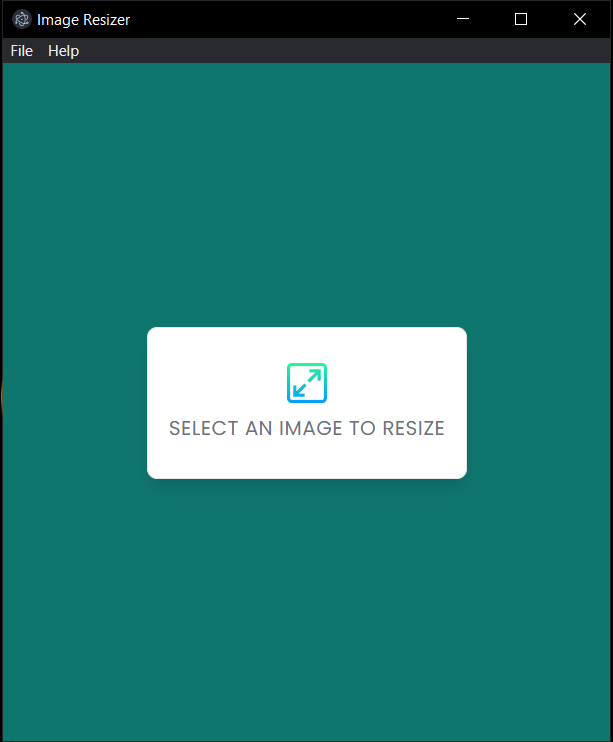
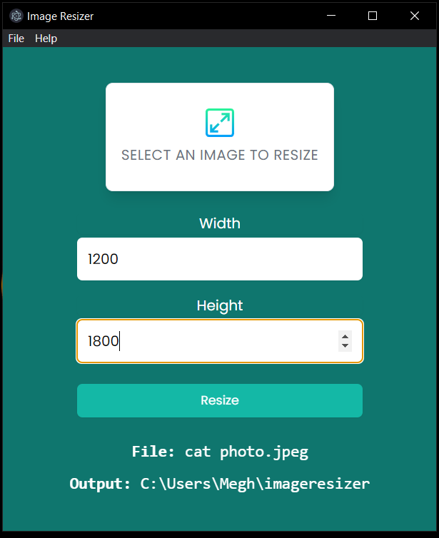

# Image Resizer App

Image Resizer App is a desktop application built using Electron.js that allows users to resize images quickly and easily. With this app, users can select multiple images and resize them all at once to a desired dimension. This app is perfect for users who frequently work with images and need to resize them for various purposes.

 

## Installation

1. Clone or download the repository
2. Install Node.js and npm (if not already installed)
3. Open the terminal/command prompt and navigate to the project directory
4. Run `npm install` to install the necessary dependencies

## Usage

1. Double-click on the `Image Resizer Setup.exe` file to start the setup
2. Install the application and run it.
3. Click on the "Select Image" button to select the image you want to resize
4. Set the desired width and height of the resized image
5. Click on the "Resize Image" button to resize the selected image
6. The resized image will be saved in a new folder and the folder will open up for you.

## Contributing

Contributions to this project are welcome. If you would like to contribute, please fork the repository and submit a pull request with your changes.

## License

This project is licensed under the MIT License - see the [LICENSE](LICENSE) file for details.
